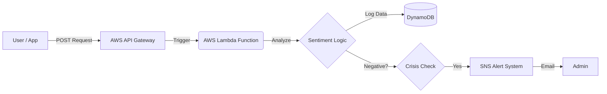

# 🎭 Vibe-Check: Serverless Sentiment Analysis API


**Vibe-Check** is a real-time sentiment analysis engine built on **AWS Serverless Architecture**. It exposes a public REST API that analyzes customer feedback, logs the "emotional temperature" to a NoSQL database, and automatically triggers **Crisis Alerts** (via Email) when negative sentiment is detected.

## Architecture Flow

The system uses an **Event-Driven** pattern to handle requests without managing servers.


## Tech Stack
**Compute:** AWS Lambda (Serverless Python Functions).

**API Layer:** AWS API Gateway (REST Endpoint).

**Database:** AWS DynamoDB (NoSQL log of all requests).

**Notifications:** AWS SNS (Simple Notification Service) for real-time alerts.

**Infrastructure as Code:** Boto3 scripts to auto-deploy resources.

## Key Features
**Serverless:** Runs entirely on the cloud with $0 idle cost.

**Crisis Detection:** Instantly identifies "Negative" feedback (e.g., "Trash", "Hate") and routes it to support teams via SNS.

**Public API:** Accessible via curl or any HTTP client from anywhere in the world.

**Auto-Scaling:** Can handle 1 request or 1,000 requests per second automatically.

## Setup & Deployment
**1. Clone the Repo**

```Bash

git clone https://github.com/Tannishaa/vibe-check.git
```
**2. Install Dependencies**

```Bash
pip install -r requirements.txt
```
**3. Configure AWS Create a config.py file with your specific ARNs (see config.example.py).**

**4. Deploy Infrastructure**

```Bash

# Creates DynamoDB Table, SNS Topic, and IAM Roles
python setup_infra.py

# Deploys the Lambda Function code
python deploy.py

# Configures the Public API Gateway
python setup_api.py
```
## Usage
Send a POST request to the API:

```PowerShell

# PowerShell Example
Invoke-RestMethod -Uri "YOUR_API_URL/analyze" -Method POST -Body '{"text": "I hate this service!"}'
```
Response:

```JSON

{
    "message": "Analysis Complete",
    "sentiment": "NEGATIVE",
    "id": "b90f6801-0384-4bce-b90e..."
}
```
If the sentiment is NEGATIVE, an email alert is sent immediately.

### Built by Tanisha.